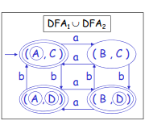

# Union, Intersection, and Difference in DFAs

## Initial Steps


1. Identify the DFAs to be used 
> If a description of an automaton is given, construct first their DFA in order to proceed to the next step

We will use this DFAs in our Example:


2. Identify the states of both DFAs
   
In the given DFAs, the states are:
```

L1 = {A, B}
L2 = {C, D}

Non-accepting States:
{B, C}

Initial States:
{A, C}

Final States:
{A, D}
```

3. Find the Cartesian Product of both States (L1 X L2)

To find the cartesian product, you just need to multiply the element in L1 to all elements of L2 until you have exhausted all the elements in L1

Ex. `Cartesian Product of L1 X L2`

```
L1 X L2 = { (AC), (AD), (BC), (BD) }
```

4. (Optional & Recommended) Create a transition diagram of the final DFA.
	- To create this diagram, you must determine the transition function of each states.
	- For example, in the state AC, the transition function of `A` with an input `a` is B `(δ(A, a) = B)` and the transition function of `C` with an input `a` is C `(δ(C, a) = C)`. Therefore, the transition function of `AC` with an input `a` is just the combination of the transition of both state with an input `a`. Hence, the final transition state of AC should be `(δ(AC, a) = BC)`. 

Apply this approach until you go over the state and you will get this final transition diagram:

**Transition Diagram of the Final DFA**

|state|a|b|
|--|--|--|
|AC| BC | AD |
|AD| BD | AC |
|BC| AC | BD |
|BD| AD | BC |


5. Identify initial and final states of the L1 X L2

> *Note: the initial state of the final DFA regarding what operation to use will always be the same.*


> *The final states, however, will depend on what operation to use*

## if (operation == union)
- the final states when you find th union should be either of the final states of L1 or L2
- In our example, the final state of each DFAs is {A, D}. 
- So the final state of our final DFA should be any states that have these letters. 
- In our case, the final state of our final DFA is the following:

```
Initial States of L1 U L2 (union):
{AC}

Final states of L1 U L2 (union):
{AC, AD, BD} 

Non-Accepting States of L1 U L2 (union):
{BC}

```

## if (operation == intersection)
- The final state when you find the intersection should be th final state of both DFAs. It should be the final states in both L1 and L2
- In the given example, the final states both DFA are {A, D}. So the final state of the final DFA should be the combination of these two states. Therefore, the final state should be the `(AD)` state

## if (operation == difference)
- The final state when you find the difference should be the final of L1 and its pair should not be a final state of L2
- In the given example, the only pair (state) that satisfies this condition is `(AC)` because `A` is a final state in L1 and `C` is only a Non-accepting state in L2. Therefore, only `AC` should be our final state
  

#### Final DFA design

If you have followed all the steps, the final DSA with its design should be like this:

### Union


### Intersection


### Difference
